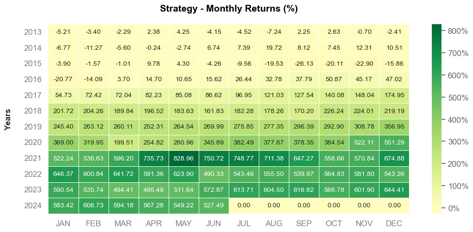
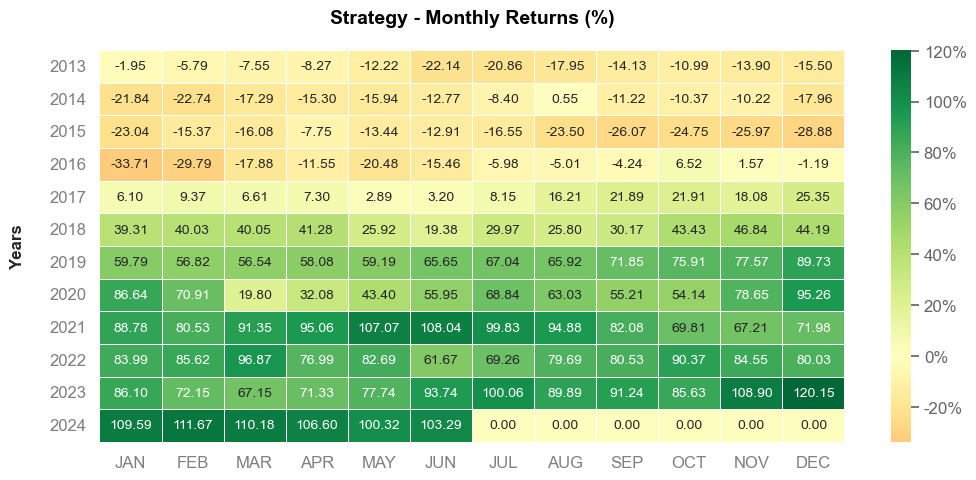

# README: Backtest do Modelo de Investimento Magic Formula no Brasil

## 📈 Desempenho Magic formula x Ibovespa

<h3 align="center">Magic Formula</h3>
<p align="center">
  
</p>

<h3 align="center">Ibovespa</h3>
<p align="center">
  

## 📌 Visão Geral
Este projeto realiza um backtest da estratégia de investimento conhecida como **Magic Formula**, desenvolvida por Joel Greenblatt, para avaliar seu desempenho no mercado brasileiro nos últimos anos. O objetivo é comparar a rentabilidade dessa estratégia com o desempenho do Ibovespa no mesmo período.

## 📊 Conteúdo do Projeto
O arquivo `magic_ibov.ipynb` contém um notebook Jupyter que executa os seguintes passos:

1. **Importação de Bibliotecas**: Utiliza `pandas`, `quantstats` e `matplotlib` para análise e visualização de dados.
2. **Carregamento dos Dados**: Dados das empresas brasileiras, incluindo preços ajustados, volume negociado, EBIT/EV e ROIC.
3. **Cálculo de Retornos Mensais**: Calcula os retornos mensais das empresas.
4. **Filtragem por Liquidez**: Remove empresas com volume negociado inferior a 1 milhão.
5. **Ranking dos Indicadores**: Classifica as empresas com base nos indicadores EBIT/EV e ROIC.
6. **Criação de Carteiras**: Seleciona as top 10 empresas com melhor ranking.
7. **Cálculo de Rentabilidade**: Compara a rentabilidade da Magic Formula com o Ibovespa.
8. **Análise de Resultados**: Gera gráficos e métricas para avaliação.

## 🧰 Bibliotecas Utilizadas

| Biblioteca      | Descrição                                                                 |
|-----------------|---------------------------------------------------------------------------|
| `pandas`        | Manipulação e análise de dados tabulares                                 |
| `numpy`         | Operações matemáticas e vetoriais                                        |
| `matplotlib`    | Visualização de dados (gráficos e figuras)                               |
| `quantstats`    | Geração de relatórios financeiros e análise de desempenho de portfólios  |
| `yfinance`      | Download de dados financeiros de ações diretamente do Yahoo Finance      |
| `seaborn`       | Gráficos estatísticos com visual mais agradável (caso tenha sido usado)  |
| `datetime`      | Manipulação de datas                                                     |
| `warnings`      | Suprimir alertas e mensagens de warning no notebook                      |


## 🎯 Comparação: Magic Formula vs. Ibovespa

### Magic Formula
**Foco**: Seleciona empresas com alto retorno sobre capital (ROIC) e alto EBIT/EV (empresas "baratas" e eficientes).

| Vantagens                          | Desvantagens                      |
|------------------------------------|------------------------------------|
| Abordagem sistemática e baseada em dados | Requer rebalanceamento periódico |
| Potencial para superar o mercado no longo prazo | Pode sofrer em períodos de alta volatilidade |

### Ibovespa
**Foco**: Índice de mercado que representa as ações mais negociadas na B3.

| Vantagens                          | Desvantagens                      |
|------------------------------------|------------------------------------|
| Diversificação natural             | Desempenho médio do mercado       |
| Baixo custo de implementação (via ETFs) | Exposto a empresas grandes, mas não necessariamente eficientes |

## 📈 Resultados

### Rentabilidade (Junho/2022)
```python
Magic Formula = 490.33
Ibovespa = 61.67
```
### Rentabilidade (Junho/2023)
```python
Magic Formula = 572.87
Ibovespa = 93.74
```